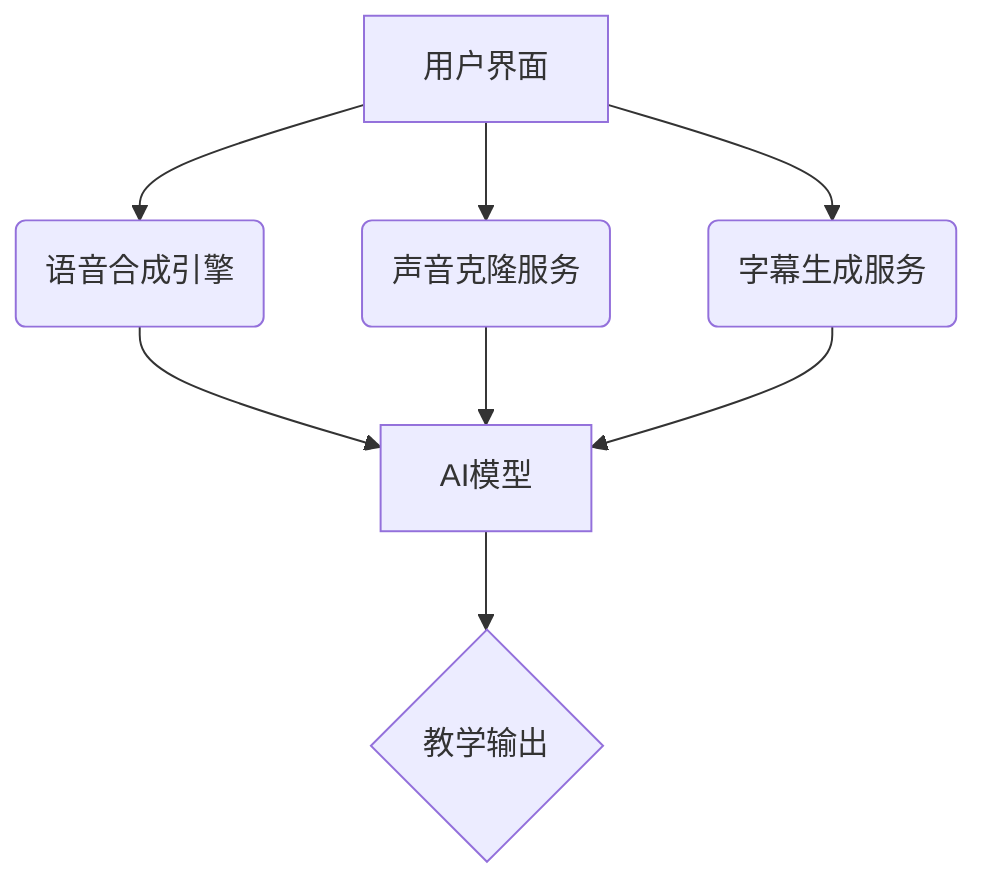

# 🎤 AI语音合成教学软件

[](https://vuejs.org/)[](https://www.typescriptlang.org/)[](https://vitejs.dev/)

**🌍 基于AI语音合成与声音克隆技术的智能教学平台**

## 📚 目录

- [✨ 核心功能](#✨ 核心功能)
- [🎯 用户价值](#🎯 用户价值)
- [🛠️ 技术架构](#️🛠️ 技术架构)
- [📂 项目结构](#📂 项目结构)
- [⚡ 快速启动](#⚡ 快速启动)
- [🔮 未来规划](#🔮 未来规划)

## ✨ 核心功能

### 🎙️ 声音管理

- **样本库管理**：支持音频上传/实时录制（5-30秒人声样本）
- **声音克隆**：基于短样本生成个性化语音模型
- **多语言支持**：支持普通话、英语等多种语言的声音克隆

### 🗣️ 语音合成

- **智能讲解**：输入文本自动生成带情感语音（800-2000字）
- **参数调节**：
  - 语速调节（0.5x - 2.0x）
  - 语调控制
  - 情感表达
- **实时预览**：支持语音合成结果的实时试听

### 📝 字幕生成

- **音视频字幕**：支持上传音频/视频文件自动生成字幕
- **双语字幕**：支持生成中英双语字幕
- **字幕编辑**：提供字幕时间轴调整和文本编辑功能
- **格式支持**：支持MP4、AVI、MOV、MP3、WAV等格式

### 📚 课件制作

- **PPT语音注入**：上传课件自动生成有声版本
- **音视频处理**：支持声音替换与字幕同步
- **多媒体整合**：支持音视频与PPT的智能融合

## 🎯 用户价值

- 🌟 **教育公平**：虚拟教师覆盖资源匮乏地区
- 🔍 **特殊教育**：为视障/阅读障碍者提供语音辅助
- 🎧 **语言学习**：提供标准发音示范与对比
- ⚡ **教学增效**：快速生成个性化教学素材
- 📝 **字幕辅助**：自动生成字幕，提升学习体验

## 🛠️ 技术架构

### 💻 前端技术栈

- **框架**：Vue 3.5 + Composition API
- **状态**：Pinia 2.3
- **类型**：TypeScript 5.6
- **UI库**：Element Plus 2.9
- **构建**：Vite 6.0
- **动画**：GSAP 3.12 + VueUse Motion
- **样式**：SASS + Element Plus 主题定制
- **HTTP**：Axios 1.7
- **工具库**：st-common-ui-vue3 0.14

### 🌐 核心技术



## 📂 项目结构

```bash
src/
├── 📁 api          # 接口服务
├── 📁 assets       # 静态资源
├── 📁 components   # 组件
├── 📝 composables  # 组合式函数
├── 🗺️ router      # 路由配置
├── 📦 stores      # Pinia状态管理
├── 🛠️ utils      # 工具函数
├── 🖼️ views      # 页面视图
│   ├── 📁 audio    # 音视频处理
│   ├── 📁 voice    # 语音合成
│   ├── 📁 sample   # 声音样本
│   ├── 📁 courseware # 课件制作
│   ├── 📁 login    # 登录页面
│   ├── 📁 register # 注册页面
│   └── 📄 AboutView.vue # 关于页面
├── 📄 App.vue     # 根组件
├── 📄 main.ts     # 入口文件
└── 📄 app.scss    # 全局样式
```

## ⚡ 快速启动

```bash
# 克隆仓库
git clone git@github.com:lvjianchaos/ai-voice.git

# 安装依赖
npm install

# 启动开发环境
npm run dev

# 构建生产版本
npm run build

# 代码格式化
npm run format

# 类型检查
npm run type-check
```

## 🔮 未来规划

- 🌐 **多方言支持**：增加粤语/吴语等方言合成
- 🤖 **AI优化**：基于用户反馈的语音自适应优化
- 📱 **移动适配**：开发PWA渐进式Web应用
- 🎓 **教育生态**：接入在线教育平台API
- 🎯 **智能推荐**：基于学习内容的个性化语音推荐
- 🔄 **实时协作**：支持多人实时编辑和协作

> 🙌 欢迎通过Issue提交功能建议或通过PR参与贡献！

## 📄 许可证

MIT License

---

<div align="center">
  <p>Made with ❤️ by AI Voice Team</p>
</div>
